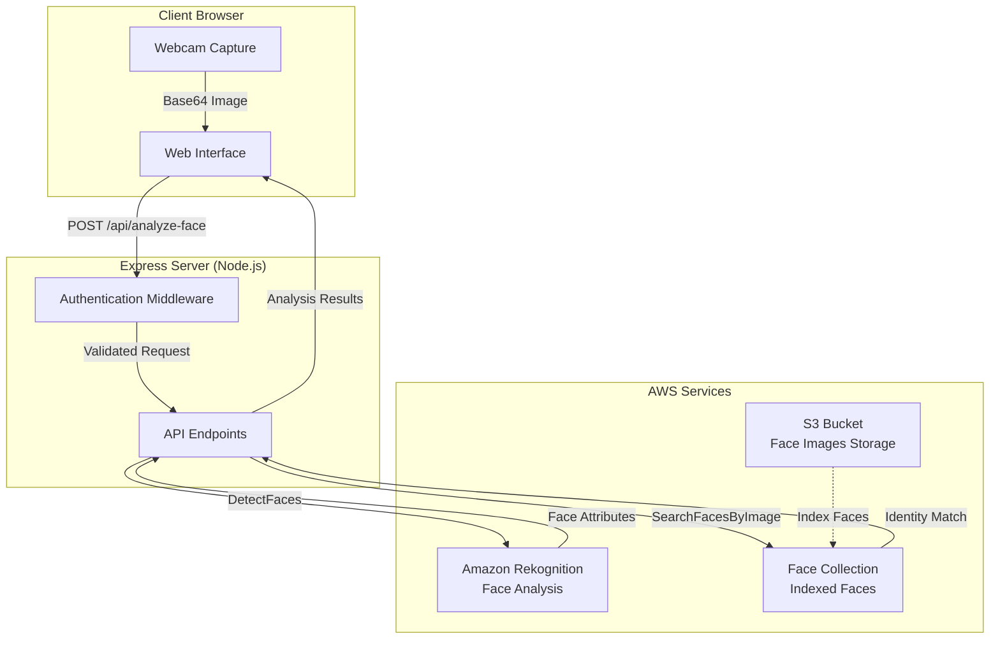

# 🎭 Face Recognition POC - AWS Rekognition

Proof of Concept for real-time facial recognition and analysis using AWS Rekognition, developed by Global Smart IoT.

[](https://nodejs.org/)
[](LICENSE)

This application captures webcam video in real-time, analyzes facial features using AWS Rekognition, and identifies registered individuals from a face collection.

---

## 📋 Table of Contents

- [🎭 Face Recognition POC - AWS Rekognition](#-face-recognition-poc---aws-rekognition)
  - [📋 Table of Contents](#-table-of-contents)
  - [✨ Features](#-features)
    - [Real-Time Facial Analysis](#real-time-facial-analysis)
    - [Technical Features](#technical-features)
  - [🏗️ Architecture](#️-architecture)
  - [📦 Prerequisites](#-prerequisites)
  - [🚀 Installation](#-installation)
  - [⚙️ Configuration](#️-configuration)
  - [🔐 AWS Setup](#-aws-setup)
    - [IAM User Configuration](#iam-user-configuration)
    - [S3 Bucket Setup](#s3-bucket-setup)
    - [Rekognition Collection Setup](#rekognition-collection-setup)
  - [🎯 Usage](#-usage)
  - [📁 Project Structure](#-project-structure)
  - [🔌 API Endpoints](#-api-endpoints)
    - [Public Endpoints](#public-endpoints)
    - [Protected Endpoints (require session)](#protected-endpoints-require-session)
  - [🎭 Facial Attributes Detected](#-facial-attributes-detected)
  - [🔒 Security Considerations](#-security-considerations)
    - [Production Recommendations](#production-recommendations)
  - [🐛 Troubleshooting](#-troubleshooting)
    - [Common Issues](#common-issues)
    - [Enable Debug Logs](#enable-debug-logs)
  - [🤝 Contributing](#-contributing)
  - [📄 License](#-license)
  - [👥 Authors](#-authors)
  - [🙏 Acknowledgments](#-acknowledgments)

---

## ✨ Features

### Real-Time Facial Analysis
- **Live Webcam Integration**: Continuous video capture with automatic frame analysis
- **Identity Matching**: Recognizes registered individuals from AWS Rekognition collections
- **Comprehensive Facial Attributes**:
  - Gender detection (Male/Female) with confidence score
  - Age range estimation
  - Emotion analysis (displays top 3 emotions)
  - Smile detection
  - Eyeglasses/Sunglasses detection
  - Beard and mustache detection
  - Eyes open/closed status
  - Mouth open/closed status

### Technical Features
- **Configurable Analysis Interval**: Adjustable capture frequency (default: 1.5 seconds)
- **Auto-Capture System**: Continuous analysis without manual intervention
- **Session Management**: Simple password-based authentication
- **Responsive Design**: Optimized for widescreen displays (16:9 aspect ratio)
- **Real-Time Updates**: Results refresh automatically as faces are detected
- **Scrollable Results Panel**: Clean UI with independent scroll for analysis results

---

## 🏗️ Architecture


**Flow Description:**
1. User authenticates with password
2. Webcam captures frames at configured interval
3. Frames sent as Base64 to Express backend
4. Backend calls AWS Rekognition for:
   - Face detection and attribute analysis
   - Identity matching against collection
5. Results displayed in real-time on the UI

---

## 📦 Prerequisites

- **Node.js**: >= 18.0.0
- **pnpm**: Package manager (or npm/yarn)
- **AWS Account** with:
  - IAM user with programmatic access
  - S3 bucket for face images
  - Rekognition service enabled
- **Webcam**: For live video capture

---

## 🚀 Installation

1. **Clone the repository:**
```bash
git clone https://github.com/Global-Smart-IoT/poc_face_rekognition.git
cd poc_face_rekognition
```

2. **Install dependencies:**
```bash
pnpm install
```

3. **Configure environment variables** (see [Configuration](#-configuration))

4. **Start the development server:**
```bash
pnpm dev
```

5. **Access the application:**
Open your browser and navigate to `http://localhost:3000`

---

## ⚙️ Configuration

Create and configure the `env.js` file in the root directory:
```javascript
export const env = {
    aws: {
        REGION: 'us-east-1',
        credentials: {
            ACCESS_KEY_ID: 'YOUR_AWS_ACCESS_KEY_ID',
            SECRET_ACCESS_KEY: 'YOUR_AWS_SECRET_ACCESS_KEY'
        },
        services: {
            rekognition: {
                COLLECTION_ID: 'faces-collection',
                FACE_MATCH_THRESHOLD: 80 // Minimum similarity % for match
            },
            s3: {
                BUCKET_NAME: 'your-s3-bucket-name'
            }
        }
    },
    express: {
        PORT: 3000
    },
    analysis: {
        CAPTURE_INTERVAL_SECONDS: 1.5 // Analysis frequency
    },
    auth: {
        PASSWORD: 'YourSecurePassword123' // Change this!
    }
}
```

**Important:** Add `env.js` to your `.gitignore` to prevent credential exposure.

---

## 🔐 AWS Setup

### IAM User Configuration

1. **Create IAM User:**
   - Go to AWS IAM Console
   - Create user: `rekognition-app-user`
   - Enable "Programmatic access"

2. **Attach Policies:**
```json
{
    "Version": "2012-10-17",
    "Statement": [
        {
            "Effect": "Allow",
            "Action": [
                "rekognition:DetectFaces",
                "rekognition:SearchFacesByImage",
                "rekognition:IndexFaces",
                "rekognition:DescribeCollection",
                "s3:GetObject",
                "s3:PutObject"
            ],
            "Resource": "*"
        }
    ]
}
```

3. **Save Credentials:**
   - Copy `Access Key ID` and `Secret Access Key`
   - Add them to `env.js`

### S3 Bucket Setup

1. **Create S3 Bucket:**
```bash
aws s3 mb s3://your-face-recognition-bucket --region us-east-1
```

2. **Upload Face Images:**
Organize images by person:
```
s3://your-bucket/
├── person1/
│   ├── photo1.png
│   ├── photo2.png
│   └── ...
├── person2/
│   ├── photo1.png
│   └── ...
```

3. **Keep Bucket Private:**
No public access required - Rekognition uses IAM credentials.

### Rekognition Collection Setup

1. **Create Collection:**
```bash
aws rekognition create-collection \
    --collection-id faces-collection \
    --region us-east-1
```

2. **Index Faces (example for 34 images):**
```bash
# Index all photos for person1
for i in {1..34}; do
  aws rekognition index-faces \
    --collection-id faces-collection \
    --image '{"S3Object":{"Bucket":"your-bucket","Name":"person1/photo'$i'.png"}}' \
    --external-image-id "Person1" \
    --region us-east-1
  echo "Indexed person1/photo$i.png"
done
```

3. **Verify Collection:**
```bash
aws rekognition describe-collection \
    --collection-id faces-collection \
    --region us-east-1
```

---

## 🎯 Usage

1. **Start the application:**
```bash
pnpm dev
```

2. **Login:**
   - Open `http://localhost:3000`
   - Enter the password configured in `env.js`

3. **Start Analysis:**
   - Click "Start Camera & Analysis"
   - Allow webcam permissions
   - Analysis begins automatically

4. **View Results:**
   - Identity match (if recognized)
   - Facial attributes update in real-time
   - Results appear in the right panel

5. **Stop Analysis:**
   - Click "Stop Camera & Analysis"
   - Webcam turns off and analysis stops

---

## 📁 Project Structure
```
poc_face_rekognition/
├── public/
│   ├── assets/
│   │   └── logo.png              # Global Smart IoT logo
│   ├── index.html                # Main HTML (login + app)
│   ├── styles.css                # Global Smart IoT design system
│   └── app.js                    # Frontend logic (webcam + API calls)
├── server.js                     # Express server + API endpoints
├── env.js                        # Environment configuration (gitignored)
├── package.json                  # Dependencies and scripts
├── .gitignore                    # Git ignore rules
├── CHANGELOG.md                  # Version history
└── README.md                     # This file
```

---

## 🔌 API Endpoints

### Public Endpoints

| Endpoint | Method | Description |
|----------|--------|-------------|
| `/api/health` | GET | Health check |
| `/api/config` | GET | Get capture interval config |
| `/api/login` | POST | Authenticate user |

### Protected Endpoints (require session)

| Endpoint | Method | Description |
|----------|--------|-------------|
| `/api/analyze-face` | POST | Analyze face from Base64 image |

**Request Example (`/api/analyze-face`):**
```json
{
  "image": "base64_encoded_image_data..."
}
```

**Response Example:**
```json
{
  "faceDetected": true,
  "identity": {
    "faceId": "uuid-face-id",
    "externalImageId": "PersonName",
    "similarity": 99.87
  },
  "attributes": {
    "Gender": { "Value": "Male", "Confidence": 99.9 },
    "AgeRange": { "Low": 25, "High": 35 },
    "Emotions": [
      { "Type": "HAPPY", "Confidence": 98.5 },
      { "Type": "CALM", "Confidence": 1.2 }
    ],
    "Smile": { "Value": true, "Confidence": 95.3 },
    "Eyeglasses": { "Value": true, "Confidence": 99.1 },
    ...
  }
}
```

---

## 🎭 Facial Attributes Detected

| Attribute | Description |
|-----------|-------------|
| **Gender** | Male or Female with confidence percentage |
| **Age Range** | Estimated age bracket (e.g., 25-35 years) |
| **Emotions** | Top 3 emotions (HAPPY, SAD, ANGRY, CONFUSED, CALM, etc.) |
| **Smile** | Whether person is smiling |
| **Eyeglasses** | Wearing regular glasses |
| **Sunglasses** | Wearing sunglasses |
| **Beard** | Presence of beard |
| **Mustache** | Presence of mustache |
| **Eyes Open** | Whether eyes are open |
| **Mouth Open** | Whether mouth is open |

All attributes include confidence scores from AWS Rekognition.

---

## 🔒 Security Considerations

### Production Recommendations

1. **Authentication:**
   - Replace simple password with proper authentication (OAuth, JWT)
   - Implement rate limiting
   - Add HTTPS

2. **AWS Credentials:**
   - Never commit `env.js` to version control
   - Use AWS Secrets Manager for credentials in production
   - Rotate IAM keys regularly

3. **Session Management:**
   - Current implementation uses in-memory sessions (resets on server restart)
   - For production, use Redis or database-backed sessions
   - Implement session expiration

4. **API Security:**
   - Add CORS restrictions
   - Implement request validation
   - Add API rate limiting

---

## 🐛 Troubleshooting

### Common Issues

**Issue:** "Could not access webcam"
- **Solution:** Check browser permissions for camera access
- Chrome: `chrome://settings/content/camera`
- Firefox: Permissions icon in address bar

**Issue:** "Unauthorized" errors on `/api/analyze-face`
- **Solution:** Check that session is valid, re-login if necessary
- Restart server to reset sessions

**Issue:** No face detected
- **Solution:** 
  - Ensure good lighting
  - Face fully visible in camera
  - Camera positioned at eye level

**Issue:** Person not recognized
- **Solution:**
  - Check face is indexed in collection
  - Lower `FACE_MATCH_THRESHOLD` in `env.js`
  - Add more photos of person to collection

**Issue:** AWS errors (403, 400)
- **Solution:**
  - Verify IAM permissions
  - Check AWS credentials in `env.js`
  - Ensure collection exists and has indexed faces

### Enable Debug Logs

The application includes comprehensive logging. Check:
- **Browser Console** (F12): Frontend logs
- **Terminal**: Server logs

---

## 🤝 Contributing

This is a proof of concept for internal use at Global Smart IoT. For questions or improvements, contact the development team.

---

## 📄 License

Copyright © 2026 Global Smart IoT. All rights reserved.

This is proprietary software developed for internal proof of concept purposes.

---

## 👥 Authors

**Global Smart IoT Development Team**
- Website: [globalsmartiot.es](https://globalsmartiot.es)
- Email: info@globalsmartiot.es

---

## 🙏 Acknowledgments

- **AWS Rekognition** for facial recognition capabilities
- **Global Smart IoT** for design system and branding
- Built with ❤️ using Node.js and Express

---

**Note:** This is a Proof of Concept. For production deployment, implement proper authentication, session management, and security measures as outlined in the Security Considerations section.